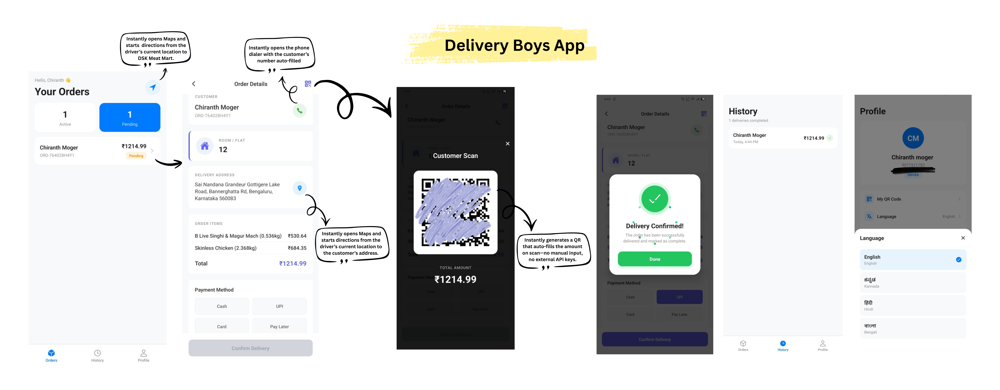
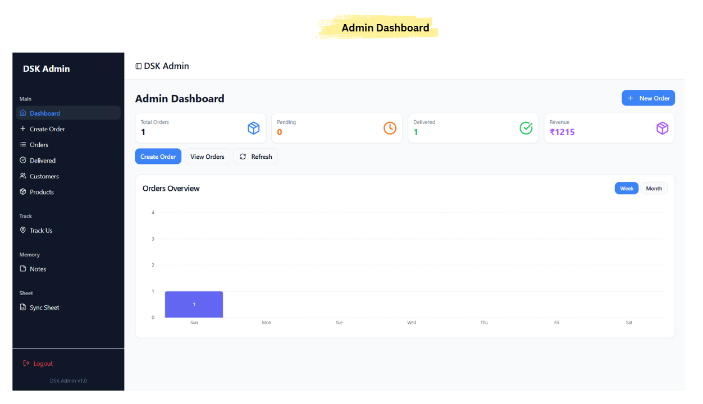
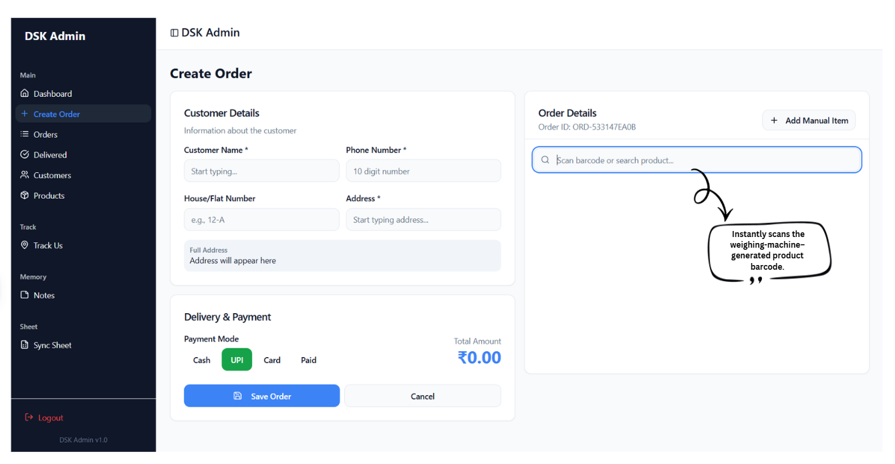
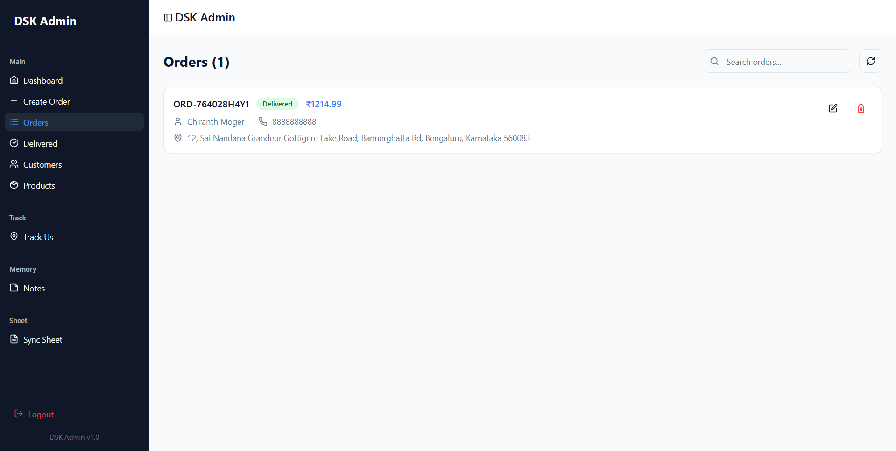
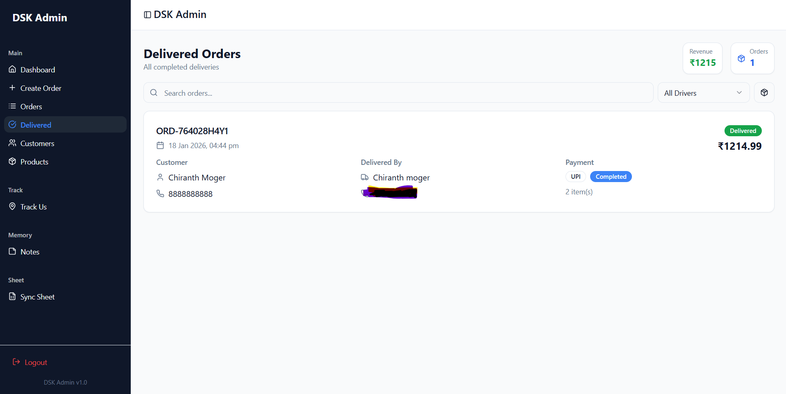
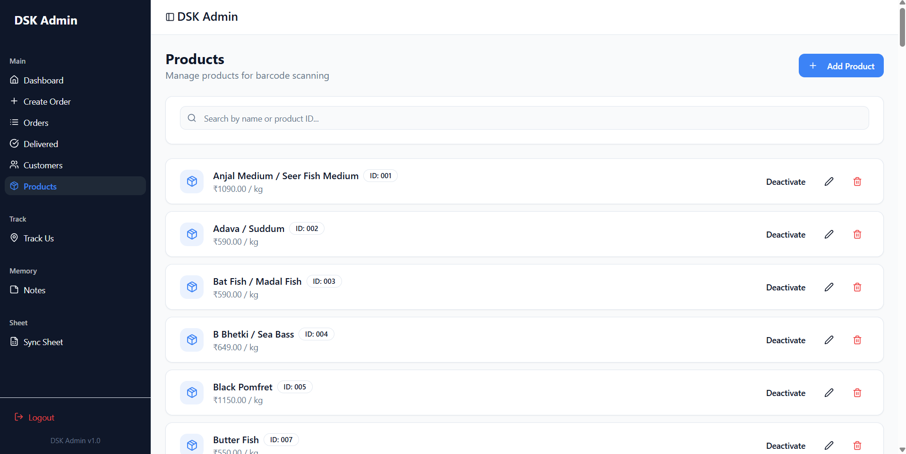
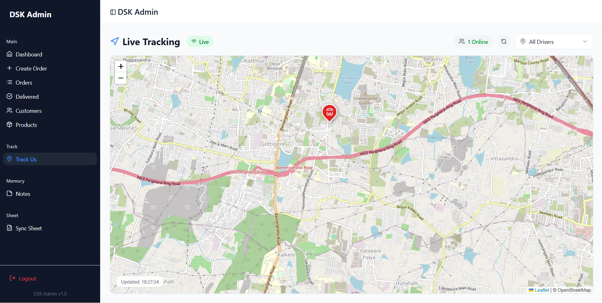

<h1 style="font-size: 3rem; background: linear-gradient(90deg, #3b82f6, #22c55e); -webkit-background-clip: text; color: transparent;">
 DSK Delivery System
</h1>

  <mark style="
    background:#fde047;
    padding:4px 8px;
    border-radius:2px;
    font-weight:700;
    color:#1f2937;
  ">
    Second Client Project
  </mark>
  &nbsp;•&nbsp;
  <strong>Production-Ready Delivery Platform</strong>

DSK Delivery System is a full-stack delivery management platform built for real-world
operations with a strong focus on **security-first development**, **reliability**, and
**scalability**. The platform enables end-to-end delivery workflows, secure role-based
access, and real-time communication across mobile and web applications.

## Project Overview

DSK Delivery System supports secure delivery operations for local businesses by providing controlled access for admins and drivers, real-time order handling, live tracking, and reliable notifications.

The system is designed with enterprise-grade backend security practices and is ready for production deployment.

**Target Users:**  
Delivery businesses, retail stores, logistics teams, fleet operators.

---
## Screenshots

### Delivery Boys App

### Admin Dashboard Website

---

##  System Architecture

- **Driver App:** React Native (Android)
- **Admin Dashboard:** React (Web)
- **Backend:** Node.js + Express
- **Database:** MongoDB
- **Real-Time Communication:** WebSockets
- **Notifications:** Firebase Cloud Messaging (FCM)

---

##  Core Features

- Real-time order creation, assignment, and status tracking  
- Live GPS tracking with background location updates and accuracy filtering  
- Role-Based Access Control (Admin / Driver)  
- Secure payment workflow logging (Cash, UPI QR, Card, Pay-Later)  
- One-tap navigation with live map directions  
- Barcode scanning for weighing-machine generated product labels  
- Dynamic QR generation with auto-filled payment amounts  
- Push notifications using FCM  
- Offline handling with automatic recovery and sync  
- Production optimizations including APK splitting, bundle reduction, and obfuscation  

---

##  Security Implementations

### Authentication & Authorization
- JWT-based authentication with access and refresh tokens  
- Secure token expiry and refresh handling  
- Server-side token invalidation on logout  
- Role-based route protection  
- Middleware-enforced authorization checks  

### API & Backend Security
- Rate limiting to prevent brute-force and abuse  
- Environment-based CORS whitelisting  
- Secure HTTP headers to mitigate XSS and clickjacking  
- Centralized error handling without sensitive data leakage  
- Environment-based secrets management using `.env`  

### Input Validation & Data Sanitization
- Strict request validation on all API endpoints  
- Schema-level validation using Mongoose  
- Protection against NoSQL injection  
- Sanitization of all user-generated inputs  
- Safe output encoding for frontend rendering  

### Data Protection & Integrity
- HTTPS / WSS readiness for encrypted communication  
- GPS accuracy filtering to reduce spoofing noise  
- Automatic cleanup of stale or invalid data  
- Indexed and controlled database access  
- Structured audit logs for security-critical events  

### Mobile App Security
- ProGuard code obfuscation for Android builds  
- Secure token storage for background services  
- Runtime permission handling with user consent  
- Foreground services for compliant background tracking  
- No hardcoded API endpoints  

### Network & Real-Time Security
- Secure WebSocket (WSS) support  
- Client authentication before socket registration  
- Targeted real-time message delivery  
- Automatic reconnection with fallback handling  
- FCM used only when app is backgrounded or terminated  

---
##  Tech Stack

### Frontend (Admin Dashboard)

  
  
  
  

### Backend

  
  
  
  

### Mobile App

  
  

---

